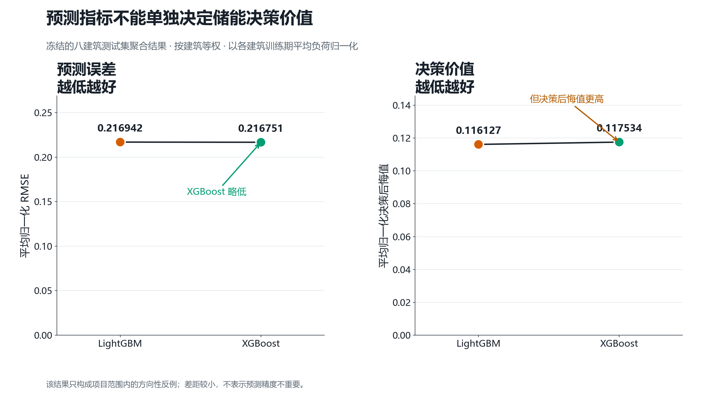
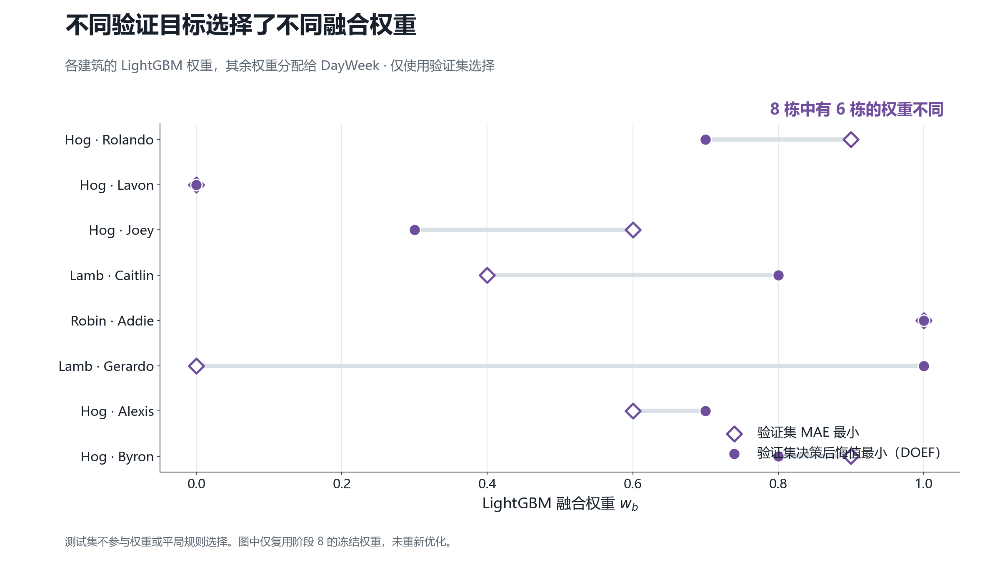
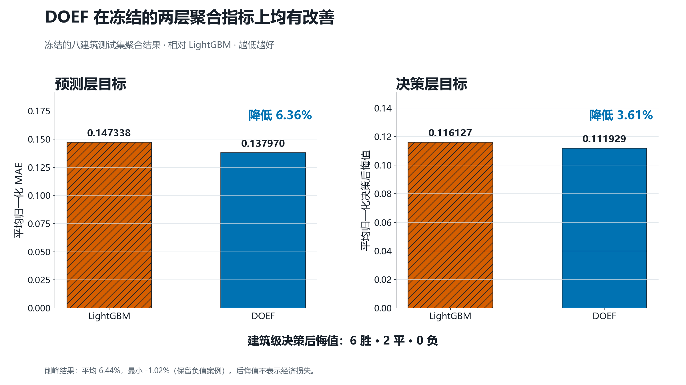
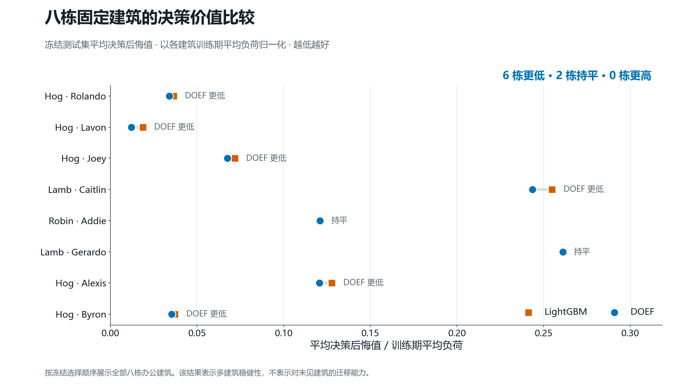

# DOEF：让负荷预测服务于储能削峰决策

全球校园人工智能算法精英大赛·算法主题赛（AI+能源）科技创新组技术报告

团队名称：［提交前填写］
日期：［提交前填写］

## 摘要

建筑负荷具有日内峰谷和周周期变化。电池储能系统可以在低负荷时段充电、在高负荷时段放电，但调度效果取决于预测误差出现的时刻和位置。即使平均绝对误差（MAE）或均方根误差（RMSE）相近，不同预测也可能形成不同的充放电计划，只按预测指标选模不足以说明模型对削峰任务的实际价值。针对这一问题，本项目提出面向储能决策的集成负荷预测方法 DOEF v1.0。该方法线性融合逐建筑 LightGBM 预测和 DayWeek 周期基线，在验证集上根据相对不可部署 Oracle 的平均日决策后悔值选择权重，再将权重冻结并用于测试集评价。实验使用 Building Data Genome Project 2（BDG2）小时级用电数据，采用时间因果切分，并在依据训练期负荷形态和预设数据质量规则选出的 8 栋办公建筑上验证。冻结结果显示，相对 LightGBM，DOEF 的八建筑平均归一化 MAE 从 0.147338 降至 0.137970，平均归一化决策后悔值从 0.116127 降至 0.111929，对应相对改善 6.36% 和 3.61%；建筑级决策后悔值为 6 胜、2 平、0 负。DOEF 的平均整段削峰率为 6.44%，最小值为 -1.02%，表明该方法仍有失效边界。这些结果支持在冻结仿真协议内用决策价值补充预测指标，但不能代表真实部署中的成本、能耗或碳排放收益。

关键词：建筑负荷预测；储能削峰；决策导向；DOEF；LightGBM

## 1. 研究背景与问题定义

### 1.1 建筑用能与电网削峰需求

建筑电力负荷通常随人员活动和使用时段形成峰谷变化。对建筑侧储能而言，削峰的直接目标不是减少全天总用电量，而是在容量、功率、效率和荷电状态约束下压低最大电网取电功率。若高峰出现前的负荷预测失真，储能可能过早放电、在真正峰值到来时能量不足，或因错误充电形成新的峰值。因此，负荷预测只有通过调度动作和实际负荷共同评价，才能反映其对储能削峰的作用。

研究对象是 24 h 超前的小时级建筑负荷预测与日内电池削峰。历史负荷和预测时刻可获得的日历信息进入预测器，预测结果驱动 24 h 确定性储能优化；调度冻结后作用于实际负荷，再计算削峰和决策后悔值。该任务不涉及在线控制，也未模拟电价、碳排放或建筑总能耗变化。

### 1.2 传统预测评价的局限

MAE、RMSE 和平均绝对百分比误差（MAPE）是必要的预测评价指标，但它们将不同时刻的误差按固定规则汇总。储能削峰对误差位置并非同等敏感：峰值附近的负荷高低和时序判断会改变充放电计划，而部分低谷误差可能对当日最大需量影响有限。因而，“预测误差更小”与“调度后的实际峰值更低”在本项目中不是同一命题。

冻结的八建筑测试集提供了一个范围明确的反例：XGBoost 的平均归一化 RMSE 为 0.216751，略低于 LightGBM 的 0.216942，但其平均归一化决策后悔值为 0.117534，高于 LightGBM 的 0.116127（图 1）。两组差距均较小，该结果只说明在本项目的固定样本和调度协议内，预测排序不能完全代替决策排序；它不支持“预测精度不重要”或普适因果结论。

**图 1｜预测指标不能单独决定储能决策价值。** 图中比较冻结的八建筑测试集等权聚合结果。XGBoost 的归一化 RMSE 略低，但归一化决策后悔值略高，表明两类指标在该实验范围内可能给出不同排序。

### 1.3 项目目标与问题定义

给定建筑 \(b\) 在预测时刻可获得的信息，预测未来 24 个小时的负荷 \(\hat{y}_{b,t}\)。预测层报告 MAE、RMSE、MAPE 及按训练期平均负荷归一化的指标；决策层以预测负荷生成电池充放电计划，并用实际负荷计算调度后的峰值、削峰率和相对 Oracle 的决策后悔值。项目目标是在不使用测试集选模的前提下，选择更适合下游储能削峰的预测组合。

### 1.4 相关技术与研究定位

建筑负荷预测研究已经比较了多类回归和机器学习模型[2,3]，部分工作也把负荷或峰值预测接入建筑、园区及电池储能优化[4-8]。predict-then-optimize 和 decision-focused learning 研究进一步讨论预测损失与下游目标的偏离，并提出任务损失训练或决策导向的模型选择方法[9-11]。DOEF 同样主张按下游用途评价预测，但实现范围较窄：它既不进行端到端训练，也不学习新的优化器，而是在已有 DayWeek 与 LightGBM 预测之间，用验证集储能决策后悔值选择逐建筑固定权重。因此，本项目的创新是可审计的任务导向融合与冻结评测闭环，不包括 LightGBM、滞后特征或通用削峰优化本身。

## 2. 数据集与实验设计

### 2.1 数据来源与单位

实验使用 BDG2 的 `electricity_cleaned.csv` 与 `metadata.csv`[1]。原始电表读数的语义是每小时区间的电能 \(E_t\)（kWh）。调度按 \(\Delta t=1\,\text{h}\) 将其解释为区间平均功率：

\[
P_t = \frac{E_t}{\Delta t}.
\]

因此数值在一小时时间步下相同，但负荷和充放电功率使用 kW，电池容量与 SOC 使用 kWh，两种单位在语义上不可互换。

### 2.2 建筑筛选与质量控制

冻结的项目选择表包含 1,578 条建筑序列，其中 296 条为办公建筑候选，82 条通过确定性覆盖与质量规则。最终 8 栋建筑由一栋既定锚点建筑与训练期负荷形态空间中的确定性最远点采样组成。形态特征包括负荷规模、变异系数、峰均比、峰谷差、24 h 与 168 h 自相关、工作日和周末差异、日曲线变异及稳健异常比例。验证集或测试集上的预测、调度成绩均未参与选楼。

这种选择方式避免用测试成绩挑选建筑，但不能据此声称模型能够迁移到未见建筑。报告中的“多建筑稳健性”仅指 8 栋预先固定办公建筑上的一致性评价。

### 2.3 因果时间切分

特征时刻的锚定时间窗见表 1。目标由固定 24 h 前视位移形成，边界处执行目标可用性清除，避免训练或验证样本引用后续区间的目标值。每栋建筑的测试集包含 720 个小时目标，即 30 个完整调度日。

**表 1｜冻结的数据切分与用途**

| 数据分区 | 特征时刻范围 | 主要用途 | 是否参与最终报告评价 |
| --- | --- | --- | --- |
| 训练集 | 2016-01-15 至 2017-10-31 | 特征统计、基础模型训练、电池按训练期尺度配置 | 否 |
| 验证集 | 2017-11-01 至 2017-11-30 | 基础模型与 DOEF 权重选择、平局规则执行 | 否 |
| 测试集 | 2017-12-01 至 2017-12-30 | 冻结算法的最终评价 | 是 |

测试集不参与建筑选择、模型参数选择或融合权重选择。由于历史项目阶段已经查看过测试结果，本报告称其为“冻结的留出评价期”，不称为从未查看的全新盲测集。

## 3. 建筑负荷预测方法

### 3.1 周期基线

表 2 给出实际使用的预测基线。项目早期材料中的 Persistence 与 Day 是同一科学方法，不作为两个独立基线重复计数。DayWeek 是固定周期平均，不含学习参数。

**表 2｜预测方法及其定义**

| 方法 | 定义或作用 |
| --- | --- |
| Day Persistence | \(\hat{y}_t=y_{t-24}\)，沿用前一日同小时实际负荷 |
| Week | \(\hat{y}_t=y_{t-168}\)，沿用前一周同小时实际负荷 |
| DayWeek | \(\hat{y}_t=0.5y_{t-24}+0.5y_{t-168}\) |
| LightGBM | 逐建筑训练的梯度提升树预测器 |
| XGBoost / CatBoost | 冻结对比模型 |
| DOEF | DayWeek 与 LightGBM 的验证集决策导向融合 |

### 3.2 LightGBM 与因果特征

LightGBM 能处理非线性关系、离散日历状态和多尺度滞后特征，训练与推理开销也较低。输入包括当前特征时刻的负荷、日历编码、1/2/3/24/48/72/168/336 h 正滞后，以及先移位后计算的滚动统计。所有特征在预测时刻均可获得；项目没有使用未来目标或未来天气，也没有加入天气、节假日等外部数据。每栋建筑的候选参数和验证集选择结果均记录在冻结配置中。LightGBM 是基础预测器，并非本项目原创算法。

### 3.3 预测指标

设测试样本数为 \(n\)，实际负荷为 \(y_i\)，预测负荷为 \(\hat{y}_i\)，则：

\[
\mathrm{MAE}=\frac{1}{n}\sum_{i=1}^{n}|y_i-\hat{y}_i|,
\qquad
\mathrm{RMSE}=\sqrt{\frac{1}{n}\sum_{i=1}^{n}(y_i-\hat{y}_i)^2},
\]

\[
\mathrm{MAPE}=\frac{100\%}{|\mathcal I|}\sum_{i\in\mathcal I}\left|\frac{y_i-\hat{y}_i}{y_i}\right|,
\qquad \mathcal I=\{i:|y_i|>10^{-12}\}.
\]

跨建筑主比较采用各建筑指标除以对应训练期平均负荷后的等权平均，以免大负荷建筑仅因量级主导结果。MAPE 对接近零负荷敏感，因此作为补充指标，不用于支持核心排序结论。

## 4. 储能削峰优化模型

### 4.1 电池配置

每栋建筑使用按训练期平均日用电量缩放的独立电池，但所有预测方法共享该建筑的同一配置。名义容量为训练期平均日用电量的 10%，最大充电与放电功率均为容量的 25%/h。SOC 范围为 10% 至 90%，每天初始和终止 SOC 均为 50%。充、放电效率均为 \(\sqrt{0.9}\)，往返效率为 90%。表 3 汇总共同规则；逐建筑容量从 20.507 kWh 到 2,857.763 kWh，完整数值由冻结配置给出。

**表 3｜冻结电池共同参数**

| 参数 | 取值 |
| --- | ---: |
| 容量规则 | 训练期平均日用电量的 10% |
| 最大充电功率 | 容量的 25%/h |
| 最大放电功率 | 容量的 25%/h |
| SOC 下限 / 上限 | 10% / 90% |
| 日初 / 日末 SOC | 50% / 50% |
| 充电效率 / 放电效率 | 0.948683 / 0.948683 |
| 往返效率 | 0.90 |
| 调度周期 | 24 h，每日重置 |

### 4.2 确定性日调度

对每个 24 h 调度日，令 \(c_t\ge 0\) 和 \(d_t\ge 0\) 分别为充电、放电功率，\(s_t\) 为 SOC，\(z_t\in\{0,1\}\) 为互斥模式变量，\(p^{\max}\) 为预测负荷下的目标峰值。冻结实现求解：

\[
\min \; p^{\max}+\epsilon\sum_{t=1}^{24}(c_t+d_t),
\qquad \epsilon=10^{-6},
\]

并满足

\[
\hat{y}_t+c_t-d_t\le p^{\max},
\]

\[
s_{t+1}=s_t+\eta_c c_t-\frac{d_t}{\eta_d},
\]

\[
s^{\min}\le s_t\le s^{\max},\quad
0\le c_t\le z_t P_c^{\max},\quad
0\le d_t\le (1-z_t)P_d^{\max},
\]

\[
s_1=s_{25}=0.5C.
\]

该混合整数线性规划由 `scipy.optimize.milp` 求解。调度阶段只读取预测负荷，实际未来负荷不参与求解；实际负荷仅在计划冻结后用于计算实现峰值。Oracle 以实际负荷求解同一问题，只作为不可部署的评价参照。

### 4.3 决策评价

实现电网负荷为 \(g_t=y_t+c_t-d_t\)。整段削峰率定义为：

\[
r_{\text{peak}}=\frac{\max_t y_t-\max_t g_t}{\max_t y_t}\times100\%.
\]

某日的决策后悔值定义为预测驱动计划的实际日峰值与 Oracle 实际日峰值之差：

\[
R_d=\max_{t\in d}g_t^{\text{method}}-\max_{t\in d}g_t^{\text{Oracle}}.
\]

后悔值的单位为 kW；归一化后除以该建筑训练期平均负荷。它不是电费、收益或碳排放意义上的“后悔”。

## 5. 从预测误差到决策误差

预测误差会先改变电池计划，再影响实际峰值，并不直接等同于决策误差。低估峰值时段可能使优化器预留不足；高估错误时段则可能把有限能量用在非关键时段。因此，两种预测即使整体 MAE 或 RMSE 接近，也可能因为峰值时序不同而生成不同的充放电轨迹。

图 1 的 XGBoost-LightGBM 排序反例说明这种差异确实出现在冻结实验中。验证阶段进一步显示，若分别以 MAE 和决策后悔值选择同一组候选融合权重，8 栋建筑中有 6 栋得到不同权重（图 4）。这两项证据共同支持双层评价：预测指标用于检查基本拟合质量，决策指标用于评价预测进入储能优化后的任务价值。

该观察不等同于“峰值附近误差必然导致更差调度”。本项目的结果是由既定电池参数、每日 SOC 重置和确定性峰值目标共同产生；改变电池规模、动态电价或控制时域可能改变误差与决策的关系。

## 6. DOEF：面向储能决策的预测融合方法

### 6.1 方法动机与定义

DOEF v1.0 使用两个已有预测分量：DayWeek 提供稳定的日周周期参照，LightGBM 表达逐建筑的非线性负荷规律。对建筑 \(b\)，最终预测为：

\[
\hat{y}_{b,t}^{\text{DOEF}}
=w_b\hat{y}_{b,t}^{\text{LightGBM}}
+(1-w_b)\hat{y}_{b,t}^{\text{DayWeek}},
\qquad w_b\in\{0.0,0.1,\ldots,1.0\}.
\]

DOEF 不是简单平均：权重随建筑变化，并由验证集下游决策目标选择。它也不是端到端学习，因为预测器参数与储能优化器没有联合训练，决策目标只用于选择冻结候选权重。

### 6.2 验证集权重选择

对每个候选 \(w_b\)，系统先在验证集形成融合预测，再用相同电池约束逐日求解调度，并计算相对 Oracle 的平均日决策后悔值。权重按冻结的等价带和平局规则选择；候选集合、评价目标和规则均在测试前确定。选定后，\(w_b\) 固定转移到测试集，不再更新。

**表 4｜逐建筑冻结融合权重**

| 建筑 | MAE 选择的 LightGBM 权重 | 决策后悔值选择的 LightGBM 权重（DOEF） |
| --- | ---: | ---: |
| Hog_office_Rolando | 0.9 | 0.7 |
| Hog_office_Lavon | 0.0 | 0.0 |
| Hog_office_Joey | 0.6 | 0.3 |
| Lamb_office_Caitlin | 0.4 | 0.8 |
| Robin_office_Addie | 1.0 | 1.0 |
| Lamb_office_Gerardo | 0.0 | 1.0 |
| Hog_office_Alexis | 0.6 | 0.7 |
| Hog_office_Byron | 0.9 | 0.8 |

**图 4｜验证集融合权重选择。** MAE 最优权重与决策后悔值最优权重在 6 栋建筑上不同。测试集不参与权重或平局规则选择，图中只展示 Phase 8 已冻结权重。

### 6.3 与传统选模的区别

常见流程用验证集 MAE 或 RMSE 选定预测模型，再把预测直接输入优化器。DOEF 仍遵守相同的数据隔离原则，但权重依据验证集下游储能决策后悔值选择。这是一种任务导向的选择关系，不是可微的端到端训练。方法结构透明、便于复核，其能力也受到两个固定预测分量和离散权重网格的限制。

## 7. 实验结果与分析

### 7.1 预测层结果

表 5 报告冻结测试集的八建筑等权聚合结果。DOEF 的平均归一化 MAE 与 RMSE 在所列方法中最低，分别为 0.137970 和 0.207822。LightGBM 的归一化 MAE 为 0.147338，低于 DayWeek 的 0.183478，但 XGBoost 的归一化 RMSE 以 0.216751 略低于 LightGBM 的 0.216942。结果没有隐藏基线在局部指标上的优势。MAPE 在低负荷建筑上容易放大，因此不作为跨建筑主结论的依据。

**表 5｜测试集预测层聚合结果**

| 方法 | 平均归一化 MAE | 平均归一化 RMSE | 平均 MAPE（%） |
| --- | ---: | ---: | ---: |
| Day Persistence | 0.225885 | 0.430193 | 21.33 |
| Week | 0.201578 | 0.328414 | 23.52 |
| DayWeek | 0.183478 | 0.296621 | 20.03 |
| LightGBM | 0.147338 | 0.216942 | 30.90 |
| XGBoost | 0.149781 | 0.216751 | 32.48 |
| CatBoost | 0.173604 | 0.239211 | 33.14 |
| DOEF | 0.137970 | 0.207822 | 16.20 |

### 7.2 决策层结果

相对 LightGBM，DOEF 的平均归一化 MAE 从 0.147338 降至 0.137970，相对改善 6.3585%；平均归一化决策后悔值从 0.116127 降至 0.111929，相对改善 3.6147%（图 2）。建筑级决策后悔值比较为 6 胜、2 平、0 负。以建筑为重采样单位的 10,000 次 bootstrap 给出 DOEF 减 LightGBM 的平均归一化后悔值差为 -0.004198，95% 区间为 [-0.006850, -0.001719]。该区间用于描述 8 个建筑单位内的不确定性，不另作普适统计显著性声明。

**图 2｜DOEF 的冻结主结果。** 在八建筑测试集等权聚合下，DOEF 相对 LightGBM 同时降低平均归一化 MAE 和平均归一化决策后悔值。图中同时保留平均削峰率与最小削峰率，避免用均值掩盖负值案例。

整段削峰率提供不同于后悔值的工程视角。DOEF 的平均值为 6.4423%，中位数为 5.6291%，最小值为 -1.0170%，最大值为 14.0162%。负的最小值表示至少一栋建筑在该固定测试期和调度协议下出现反向削峰，故不能声称 DOEF 在每栋建筑上都降低了实际最大负荷。CatBoost 的最小削峰率为 -245.9433%，这一极端不利结果也保留在冻结证据中。

未进入 DOEF 的负结果同样保留。在锚点建筑 Phase 5.7 测试中，验证集选择的稳健调度平均后悔值为 20.4635 kW，高于确定性 LightGBM 调度的 11.1274 kW，因此稳健调度没有进入最终算法。Phase 9 的峰值加权 LightGBM 也没有产生稳定收益，只作为支持性实验记录。

### 7.3 多建筑稳健性

图 3 按冻结选择顺序展示全部 8 栋建筑。DOEF 在 6 栋建筑上的平均归一化决策后悔值低于 LightGBM，在 2 栋上因 DOEF 的冻结 LightGBM 权重为 1.0 而与 LightGBM 持平。完整展示所有建筑可避免只报告成功案例，但样本仍限于预先固定的办公建筑和一个未来测试月。

**图 3｜八栋固定建筑的决策价值比较。** 每个点是建筑测试期平均日决策后悔值除以该建筑训练期平均负荷。该图支持多建筑稳健性，不支持未见建筑、其他季节或跨年份迁移。

### 7.4 验证集选择与测试集评价

DOEF 的证据链严格遵循“验证集选择权重，冻结权重，测试集评价”。图 4 展示的是验证集上两种目标对应的已冻结权重，不含测试期优化。Phase 9.1 方法审计确认：算法选择来源为验证集，测试集仅用于评价，测试集不能晋升算法；峰值加权 LightGBM 作为未进入最终算法的支持性负结果保留。

### 7.5 冻结结果复用与可复现性

Phase 9.1 用显式 DOEF 公式、同一组冻结分量预测和 `w_decision` 权重重建测试预测，并与 Phase 8 参考预测逐点比较。8 栋建筑共 5,760 个预测值的最大绝对差为 0.0 kW，容差为 \(10^{-12}\)。同时，Phase 7/8/9/9.1 共 76 个登记科研文件通过 LF 归一化哈希审计。该证据表明报告复用了冻结预测和调度链，而不是在写作阶段重跑选模或重选结果。

**表 6｜冻结复用与完整性检查**

| 检查对象 | 规模 | 结果 |
| --- | ---: | --- |
| DOEF 测试预测逐点一致性 | 8 栋 × 720 h = 5,760 点 | 最大绝对差 0.0 kW，PASS |
| Phase 7/8/9/9.1 科研文件哈希 | 76 个文件 | 76/76 PASS |
| 算法选择数据源 | 验证集 | PASS |
| 测试集角色 | 仅评价 | PASS |
| 约束审计 | 同一冻结电池与优化器 | PASS |

## 8. 创新点

本项目只主张以下三项创新。

1. 将建筑负荷预测的评价终点从单一预测精度扩展为储能决策价值。在保留 MAE、RMSE、MAPE 的同时，引入实现峰值、削峰率和 Oracle 相对决策后悔值，明确区分预测误差与调度代价。
2. 提出 DOEF，以验证集下游削峰表现选择 DayWeek-LightGBM 的逐建筑融合权重。该方法把预测器选择与储能任务连接起来，但不将其夸大为端到端学习或通用优化理论。
3. 建立可复核的因果评测闭环。建筑依训练期形态选择，训练集、验证集和测试集角色隔离；权重和调度规则冻结后再测试，并通过 8 栋建筑全量报告、冻结预测一致性和文件哈希审计约束结果漂移。

LightGBM、周期滞后、通用电池模型和混合整数削峰优化均为已有技术组件，不列为原创算法贡献。

## 9. 工程价值

DOEF 处理的工程问题是：建筑侧储能容量有限，电量应优先留给真正影响最大需量的时段。相比只追求更低的离线预测误差，储能调度结果可以进一步检验预测模型是否服务于既定控制目标。对于采用日前计划的建筑能源管理系统，这套流程无需改变电池优化器，就能为预测器或预测组合提供与任务直接相关的验证标准。

冻结实验显示，透明的两分量融合可以在固定八建筑测试范围内同时改善预测和决策聚合指标，并保留逐建筑权重、调度约束和结果来源，便于审计和复现。其工程意义仍属于仿真证据：报告没有电价模型、需求电费账单、碳因子、硬件退化成本或现场控制数据，因此不量化成本节约、能耗下降或碳减排。

## 10. 局限性、伦理风险与未来工作

第一，数据和泛化范围有限。实验使用 8 栋预先固定办公建筑和每栋一个未来测试月，只能支持该范围内的多建筑稳健性，不能证明对未见建筑、其他季节或跨年份数据的迁移能力。未来应在预先注册的更多建筑、季节和年份上进行独立外部评价，并保持验证规则不接触新测试集。

第二，预测信息主要来自历史负荷与日历状态。项目未引入更丰富的天气、节假日、占用率或设备状态数据，因此不能判断外部变量是否会改变预测与决策排序。后续可在保持因果可用性的前提下加入这些信息，并分别检查预测层和决策层收益。

第三，电池和调度模型采用固定工程假设，包括按训练期负荷缩放容量、每日 SOC 重置、确定性 24 h 优化和固定效率。它未模拟电池老化、动态电价、光伏不确定性或滚动控制。未来工作应先明确新的实际目标，再扩展为电价、寿命和新能源协同的多目标调度，不能直接把当前削峰率解释为经济收益。

第四，项目尚未完成真实建筑在线部署。自动调度若依赖偏差较大的负荷预测，可能对不同规模或运行模式的建筑产生不均衡效果；异常数据和模型漂移也可能触发不合理充放电。工程部署应保留人工覆盖、功率与 SOC 硬约束、异常检测、回退基线和持续监测，并记录各建筑的失败案例。当前结果不涉及人员识别或敏感个体数据，但建筑运行数据仍应按数据授权和最小必要原则管理。

## 11. 结论

围绕“预测如何服务储能削峰”，本项目连通了小时级负荷预测、确定性电池调度和实际峰值评价。冻结结果表明，预测指标与决策指标在固定八建筑测试中可能给出不同排序。DOEF 根据验证集决策后悔值选择逐建筑 DayWeek-LightGBM 权重，权重冻结后再进入测试评价。相对 LightGBM，DOEF 降低了八建筑平均归一化 MAE 和平均归一化决策后悔值，建筑级决策比较为 6 胜、2 平、0 负；报告同时保留 -1.02% 的最小削峰率等不利结果。现有证据支持的结论是：在本项目的冻结数据、模型和电池协议内，决策导向选择可以补充传统预测指标，使负荷预测评价更贴近储能削峰任务。该结论不延伸到未见建筑、真实在线控制或成本和碳减排收益。

## 参考文献

[1] Miller C, et al. The Building Data Genome Project 2, energy meter data from the ASHRAE Great Energy Predictor III competition. *Scientific Data*, 2020. DOI: 10.1038/s41597-020-00712-x.

[2] Zhang L, Wen J, Li Y, Chen J, Ye Y, Fu Y, Livingood W. A review of machine learning in building load prediction. *Applied Energy*, 2021. DOI: 10.1016/j.apenergy.2021.116452.

[3] Yildiz B, Bilbao J I, Sproul A B. A review and analysis of regression and machine learning models on commercial building electricity load forecasting. *Renewable and Sustainable Energy Reviews*, 2017. DOI: 10.1016/j.rser.2017.02.023.

[4] Soman A, et al. Peak Forecasting for Battery-based Energy Optimizations in Campus Microgrids. *ACM e-Energy*, 2020. DOI: 10.1145/3396851.3397751.

[5] Hwang J S, et al. Optimal ESS Scheduling for Peak Shaving of Building Energy Using Accuracy-Enhanced Load Forecast. *Energies*, 2020. DOI: 10.3390/en13215633.

[6] Rafayal S, Alnaggar A, Cevik M. Optimizing electricity peak shaving through stochastic programming and probabilistic time series forecasting. *Journal of Building Engineering*, 2024. DOI: 10.1016/j.jobe.2024.109163.

[7] Li L, Ju Y, Wang Z. Quantifying the impact of building load forecasts on optimizing energy storage systems. *Energy and Buildings*, 2024. DOI: 10.1016/j.enbuild.2024.113913.

[8] Singleton C, Grindrod P. Forecasting for Battery Storage: Choosing the Error Metric. *Energies*, 2021. DOI: 10.3390/en14196274.

[9] Donti P L, Amos B, Kolter J Z. Task-based End-to-end Model Learning in Stochastic Optimization. *NeurIPS*, 2017.

[10] Elmachtoub A N, Grigas P. Smart Predict, then Optimize. *Management Science*, 2022. DOI: 10.1287/mnsc.2020.3922.

[11] Mandi J, et al. Decision-Focused Learning: Foundations, State of the Art, Benchmark and Future Opportunities. *Journal of Artificial Intelligence Research*, 2024. DOI: 10.1613/jair.1.15320.

## 附录 A：核心证据来源

本报告所有核心数值和方法定义均来自冻结文件：`outputs/phase7/selected_buildings.json`、`outputs/phase7/model_selection_config.json`、`outputs/phase7/building_battery_configs.csv`、`outputs/phase8/selected_weights.csv`、`outputs/phase9/final_algorithm.json`、`outputs/phase9/final_benchmark.csv`、`outputs/phase9/aggregate_metrics.csv`、`outputs/phase9/per_building_metrics.csv`、`outputs/phase9_1/final_reporting_summary.json`、`outputs/phase9_1/doef_prediction_invariance.json` 与 `outputs/phase9_1/artifact_hash_audit.json`。写作阶段未训练模型、未调整权重、未重新选择建筑、未运行改变结论的新实验。
